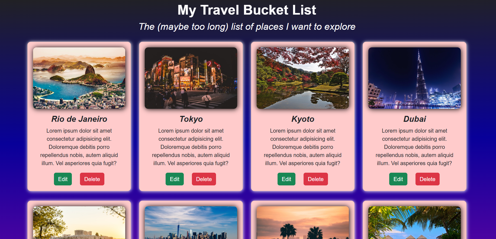
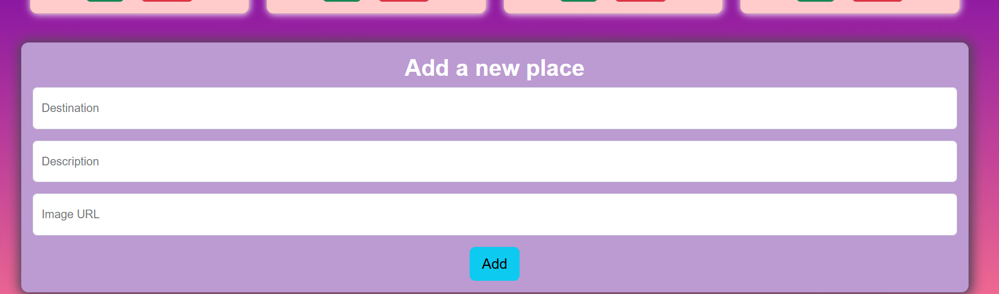
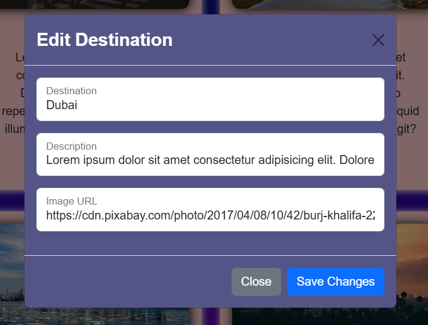

# 🌍 Travel Bucket List– CRUD React App

**Travel Bucket List** is a simple CRUD application that helps you manage places you'd love to explore. You can add, edit and delete destinations.
## 🛠 Technologies
- **Frontend:** React + JavaScript
- **Styling:** React Bootstrap

## ⚙️ Features
- View a list of all dream destinations
- Add new places
- Edit existing places
- Delete destinations

## 🚀 Getting Started
1. Open the project in your terminal.
2. Install dependencies
    ```bash
   npm install
3. Start the application
      ```bash
   npm run dev



